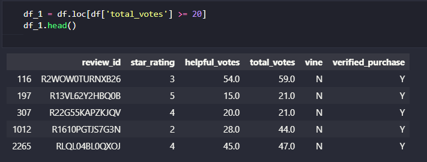
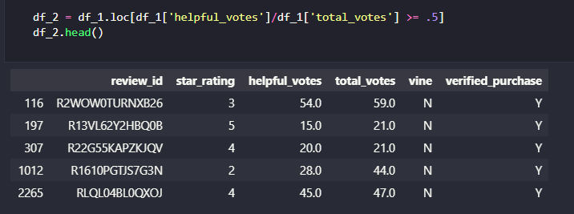
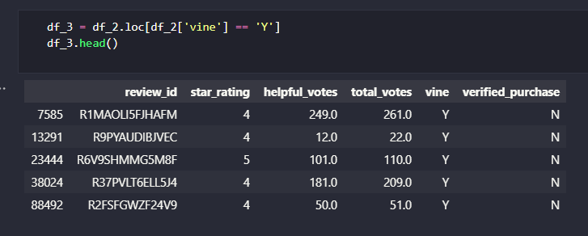
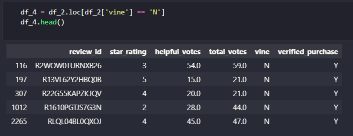
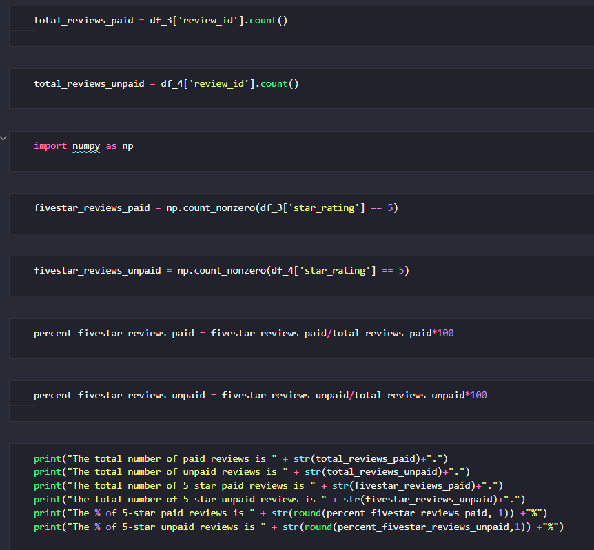

# Amazon_Vine_Analysis

## Challenge Overview
### Overview of the Amazon Vine Analysis
The purpose of this analysis was to analyze whether or not there is any bias in reviews written by members of Amazon's Vine program (membership is invitation-only based on customers' past reviews) - specifically, the effect of Vine reviews on the percentage of overall 5-star reviews.

## Resources

Original Amazon Reviews Dataset used:

https://s3.amazonaws.com/amazon-reviews-pds/tsv/amazon_reviews_us_Wireless_v1_00.tsv.gz

This dataset was used to create a table containing the following fields:
- review id
- star rating for the review
- total votes that a review received
- number of helpful votes that a review received
- whether or not the review was from a Vine member
- whether or not the review was for a Verified Purchase

## Results

The first two DataFrames were created by filtering the original DataFrame to find reviews with a significant percentage of helpful votes:

The second DataFrame was then filtered to show reviews that were and were not part of the Vine program:

- DataFrame containing paid reviews from the Vine program:

- DataFrame containing unpaid reviews not part of the Vine program:

The following calculations were then performed:

The following results were found using the above calculations:

- The total number of paid Vine reviews was 613.

- The total number of unpaid reviews was 64,968.

- The number of 5-star paid Vine reviews was 200.

- The number of 5-star unpaid reviews was 28,842.

- The % of 5-star paid Vine reviews was 32.6%.

- The % of 5-star unpaid reviews was 44.4%.

## Summary
Based on the results of this analysis, there does not seem to be a positivity bias for reviews in the Vine program - the percentage of 5-star reviews was higher for unpaid reviews.  

To test this result further, the same analysis could be run on a different Amazon review dataset (one based on reviews for a totally different Amazon product category than was reviewed in this analysis) to see if consumers of certain categories are more or less biased when reviewing certain types of products, especially when being paid (as through Amazon's Vine program).